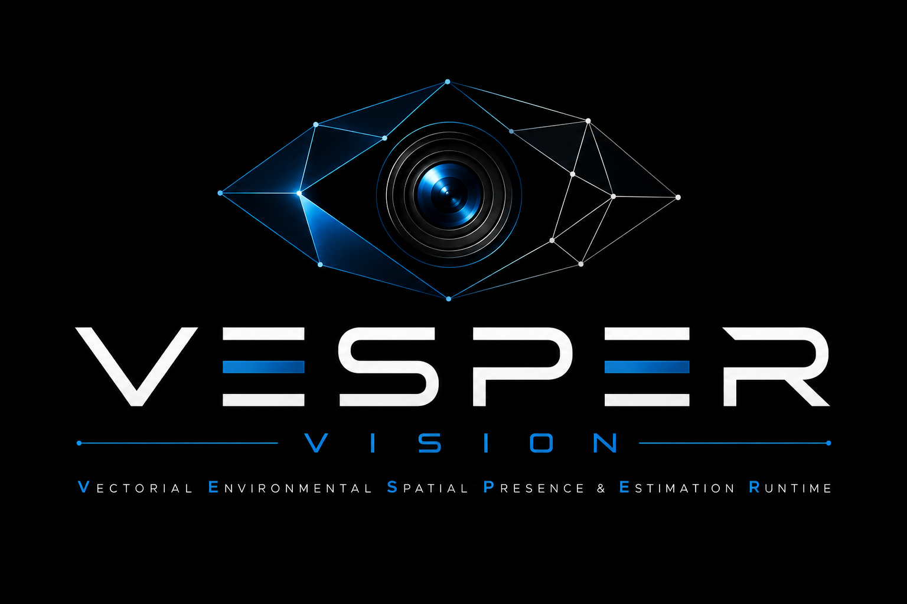

  

<h1 align="center">VESPER-VISION</h1>

Stateful spatial perception and occupancy intelligence architecture.

---

# Overview

VESPER-VISION is an experimental environmental perception architecture focused on:

- spatial environmental supervision
- contextual occupancy inference
- room-state reconstruction
- probabilistic environmental interpretation
- multimodal telemetry fusion
- stateful runtime supervision

The system combines deterministic geometric reasoning, contextual environmental
analysis, temporal persistence supervision, and multimodal occupancy estimation
to reconstruct environmental states from passive visual telemetry.

---

# VESPER Acronym

**VESPER** stands for:

## Vectorial
Environmental interpretation is reconstructed through vector-based geometric
reasoning, polygonal spatial segmentation, motion vectors, and human pose
keypoints.

## Environmental
The architecture supervises contextual environmental conditions rather than
isolated object detections.

## Spatial
Spatial reasoning operates on normalized environmental coordinates and logical
zone reconstruction.

## Presence
The system estimates contextual human presence and occupancy continuity instead
of relying on simplistic motion-triggered activation.

## Estimation
Environmental interpretation is probabilistic and multimodal, combining spatial
telemetry, pose estimation, environmental continuity, and contextual inference.

## Runtime
The architecture operates continuously through stateful runtime supervision and
persistent environmental monitoring.

---

# Core Architectural Principles

VESPER-VISION intentionally prioritizes:

- deterministic reasoning
- explainable inference
- bounded environmental supervision
- contextual state continuity
- probabilistic occupancy estimation
- adaptive environmental stabilization

over opaque autonomous surveillance-oriented architectures.

---

# Documentation

| Module | Description |
|---|---|
| [01_SPATIAL_PERCEPTION.md](docs/01_SPATIAL_PERCEPTION.md) | Spatial environmental interpretation |
| [02_OCCUPANCY_INFERENCE.md](docs/02_OCCUPANCY_INFERENCE.md) | Occupancy inference and state reasoning |
| [03_ROOM_STATE_RECONSTRUCTION.md](docs/03_ROOM_STATE_RECONSTRUCTION.md) | Contextual room-state reconstruction |
| [04_BED_STATE_ANALYSIS.md](docs/04_BED_STATE_ANALYSIS.md) | Bed occupancy interpretation |
| [05_ENVIRONMENTAL_TELEMETRY.md](docs/05_ENVIRONMENTAL_TELEMETRY.md) | Environmental telemetry supervision |
| [06_RUNTIME_SUPERVISION.md](docs/06_RUNTIME_SUPERVISION.md) | Runtime monitoring and supervision |
| [07_MULTIMODAL_FUSION.md](docs/07_MULTIMODAL_FUSION.md) | Multimodal inference fusion |
| [08_ADAPTIVE_CALIBRATION.md](docs/08_ADAPTIVE_CALIBRATION.md) | Adaptive environmental calibration |
| [09_RUNTIME_SAFETY.md](docs/09_RUNTIME_SAFETY.md) | Runtime safety and bounded execution |
| [10_PRIVACY_AND_ETHICS.md](docs/10_PRIVACY_AND_ETHICS.md) | Privacy and ethical limitations |
| [11_SCOPE_AND_LIMITATIONS.md](docs/11_SCOPE_AND_LIMITATIONS.md) | Architectural limitations |
| [12_GEOMETRY_AND_MATH.md](docs/12_GEOMETRY_AND_MATH.md) | Mathematical and geometric foundations |

---

# Architectural Characteristics

The architecture may include:

- polygonal spatial segmentation
- occupancy zone reconstruction
- contextual environmental reasoning
- bed-state occupancy supervision
- temporal hysteresis stabilization
- heatmap-based telemetry analysis
- passive environmental monitoring
- multimodal probabilistic fusion

depending on the supervised environmental configuration.

---

# Privacy Philosophy

VESPER-VISION intentionally avoids:

- facial identification
- biometric recognition
- identity attribution
- autonomous behavioral profiling

The architecture is designed for contextual environmental supervision rather
than identity-centric surveillance.

---

# Experimental Status

VESPER-VISION should be considered an experimental environmental perception
architecture intended for research, engineering experimentation, and contextual
environmental analysis.

Environmental interpretation remains probabilistic and context-dependent.

---

# License

This repository is distributed under the terms defined in the included
license file.
