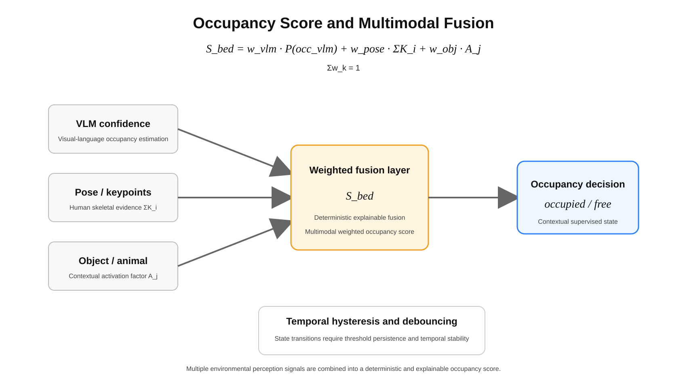
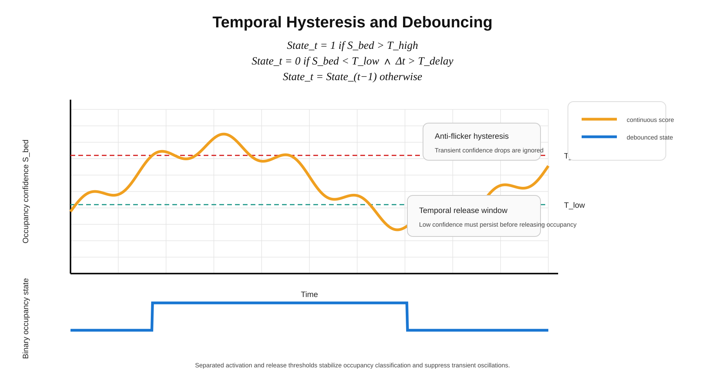

# 02 — Occupancy Inference

## Overview

Occupancy inference within Vesper Vision refers to the contextual estimation
of environmental human presence through continuous spatial interpretation and
state-aware environmental supervision.

The architecture does not treat occupancy as a binary event.

Instead, occupancy is interpreted through probabilistic environmental reasoning
built upon contextual spatial continuity and multimodal telemetry correlation.

---

## Occupancy Concepts

Occupancy analysis may include:

- human presence estimation
- occupied zone reconstruction
- passive environmental supervision
- contextual behavioral interpretation
- bed occupancy estimation
- occupancy persistence analysis
- environmental activity reconstruction

The architecture intentionally prioritizes explainable occupancy reasoning over
opaque behavioral classification systems.

---

## Stateful Occupancy

Occupancy states are evaluated continuously through:

- temporal persistence
- contextual continuity
- occupancy confidence accumulation
- environmental transition analysis
- spatial consistency supervision
- adaptive occupancy stabilization

Occupancy interpretation is therefore treated as a dynamic environmental state
rather than a sequence of isolated detections.

---

## Contextual Environmental Analysis

Occupancy estimation may incorporate contextual environmental factors such as:

- room configuration
- environmental lighting conditions
- spatial segmentation
- passive movement distribution
- occupancy duration
- zone activation continuity
- multimodal telemetry correlation

The architecture attempts to minimize impulsive occupancy transitions caused by
short-lived environmental anomalies.

---

## Bed-State Occupancy

Specialized occupancy reasoning may be applied to:

- bed occupancy estimation
- occupied bed-zone reconstruction
- multi-zone occupancy interpretation
- blanket-covered occupancy estimation
- contextual body-presence supervision

Bed-state interpretation is intentionally contextual and environment-specific.

---

## Runtime Supervision

Occupancy supervision prioritizes:

- deterministic environmental reasoning
- explainable transitions
- bounded inference logic
- contextual continuity
- adaptive confidence stabilization

The architecture intentionally avoids autonomous identity attribution,
biometric recognition, or facial identification systems.

---

## Limitations

Occupancy inference remains probabilistic.

Environmental interpretation accuracy may vary depending on:

- environmental visibility
- occlusion conditions
- room geometry
- environmental telemetry quality
- lighting variability
- contextual ambiguity
- spatial overlap conditions

Vesper Vision should therefore be considered an experimental environmental
perception architecture rather than a deterministic occupancy authority system.
