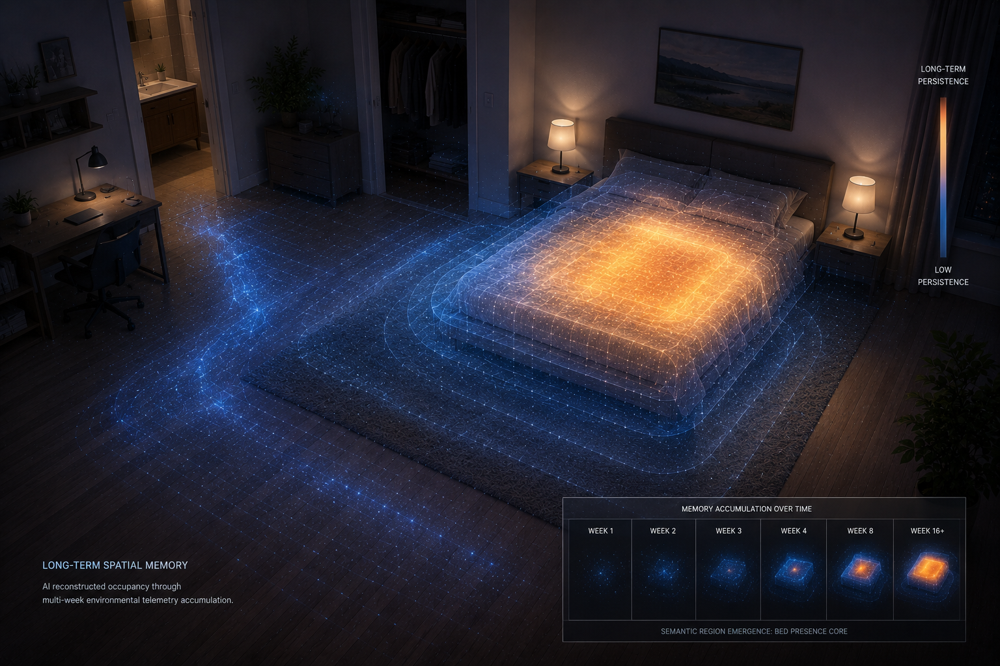
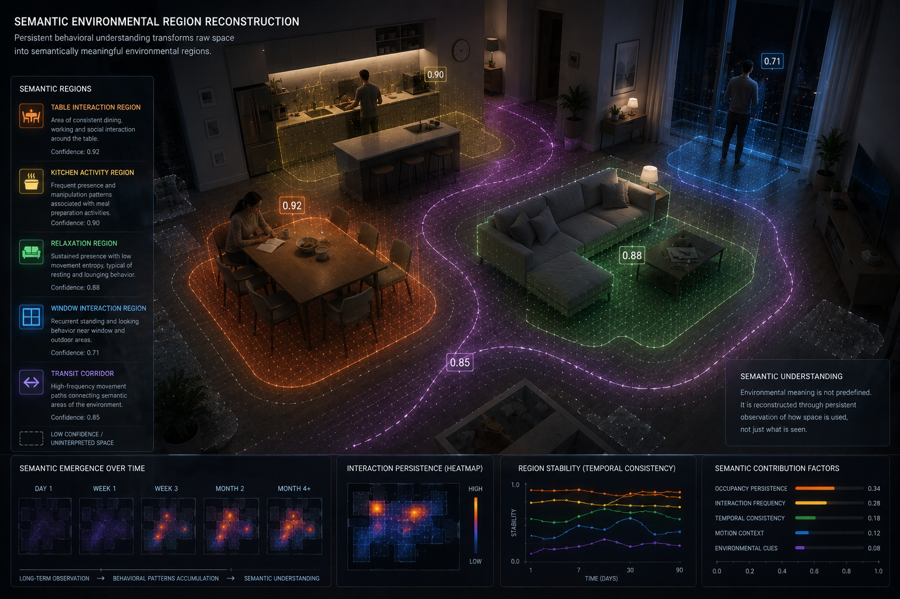
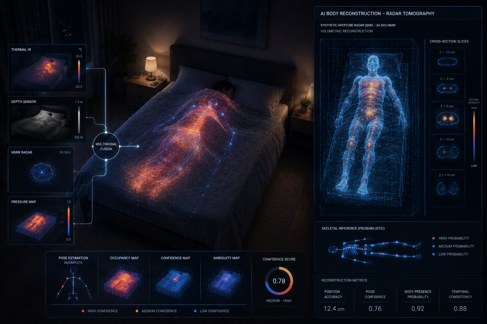
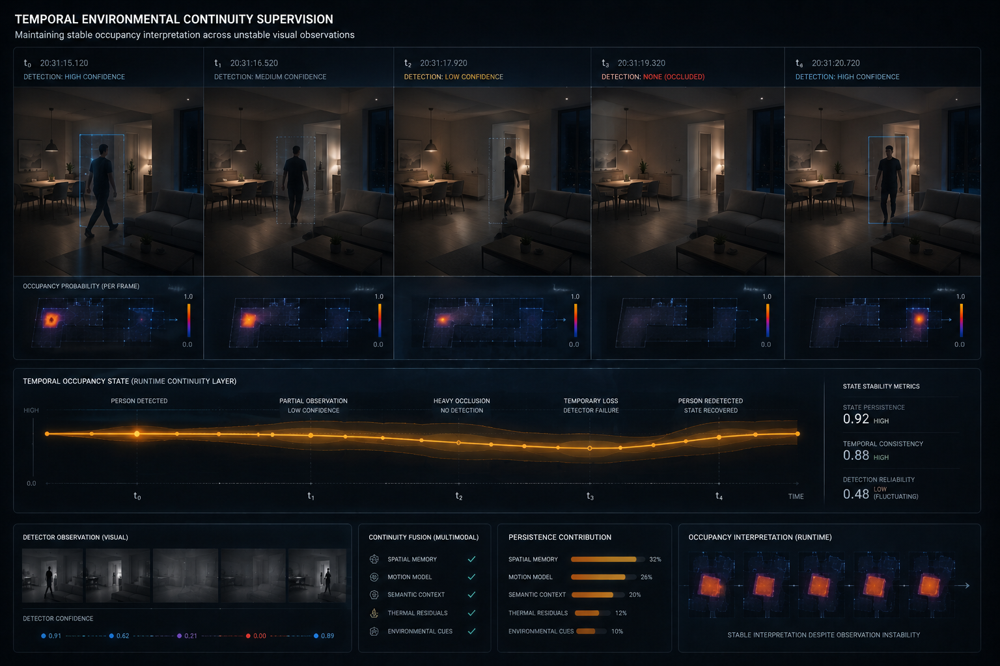
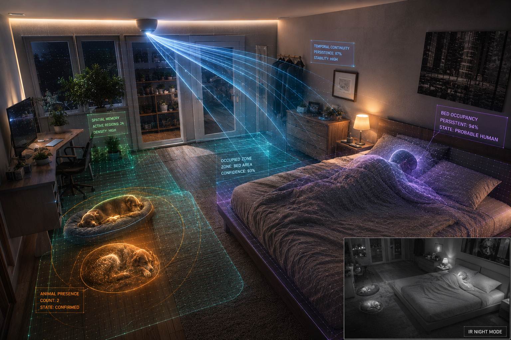
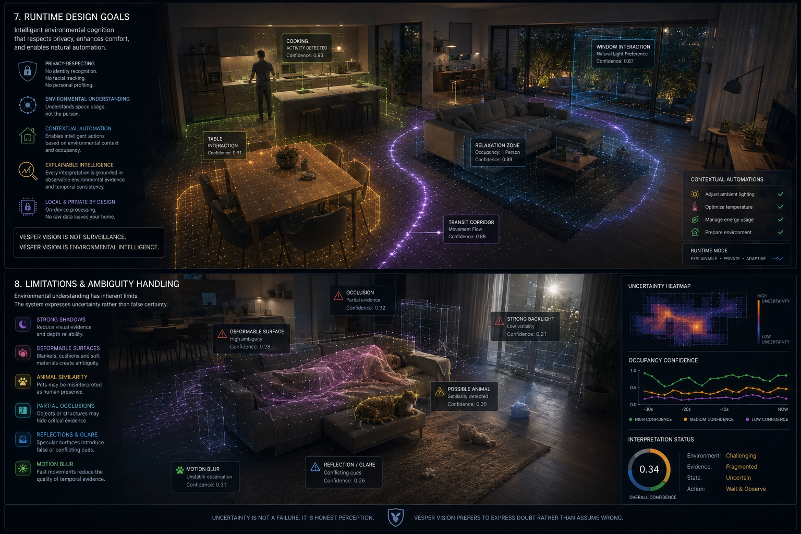

# 13 — Stateful Runtime Intelligence

## Overview

This module documents the stateful runtime supervision layer used by
Vesper Vision for continuous environmental occupancy estimation,
persistent spatial memory mapping, semantic context extraction,
and structural runtime state fusion.

Instead of processing isolated frame-by-frame detections, the runtime
architecture maintains a continuously evolving environmental hypothesis layer
capable of preserving occupancy continuity across unstable visual conditions.

The system combines:

- geometric spatial priors
- persistent telemetry accumulation
- spatial clustering
- semantic region reconstruction
- multi-modal occupancy fusion
- asymmetric confidence decay
- frame-locked state hysteresis
- contextual environmental ambiguity handling

to preserve explainable occupancy supervision even under:

- blanket coverage
- partial visibility
- unstable detections
- fragmented telemetry
- environmental ambiguity
- temporary occlusions

Unlike stateless visual pipelines, the runtime layer models occupancy as a
persistent environmental reasoning process rather than a single-frame
classification event.

---

## 1. Persistent Spatial Memory Math

Persistent environmental memory is constructed through continuous telemetry
accumulation inside the runtime spatial event journal:

```text
state/spatial_memory_events.jsonl
```

Every validated environmental observation generates a normalized tracking
coordinate projected into the environmental memory plane:

```math
p = [x,y]^T \in [0,1]^2
```

Given a historical telemetry sequence:

```math
E = \{e_1,e_2,\dots,e_N\}
```

the localized spatial density prior surrounding coordinate `p` is computed
using a fixed-radius neighbor accumulation model:

```math
D(p)
=
\sum_{i=1}^{N}
\mathbb{I}
\left(
\delta(p,e_i) < R_{prior}
\right)
```

where the Euclidean metric is defined as:

```math
\delta(a,b)
=
\sqrt{
(a_x-b_x)^2 +
(a_y-b_y)^2
}
```

The spatial integration radius:

```math
R_{prior} = 0.075
```

defines the maximum local influence boundary used during runtime density
estimation.

The resulting density field dynamically injects contextual confidence bias
into occupancy reasoning pipelines.

---



*Long-term spatial memory reconstructed through persistent environmental telemetry accumulation and probabilistic occupancy density reinforcement.*

---

## 2. Spatial Clustering and Semantic Synthesis

Long-term environmental interaction patterns are transformed into persistent
spatial regions through sequential geometric clustering.

A coordinate:

```math
p_i
```

is aggregated into cluster:

```math
\mathcal{C}_k
```

iff:

```math
\delta(p_i,\mu_k)
<
R_{cluster}
```

where:

```math
R_{cluster} = 0.065
```

defines the maximum aggregation radius surrounding cluster centroid:

```math
\mu_k
```

If no cluster satisfies the geometric constraint, a new spatial seed region is
generated.

Clusters collecting fewer than:

```math
M_{min} = 12
```

validated observations are discarded to suppress environmental noise
propagation.

The spatial center of mass for validated regions is computed as:

```math
\mu_k
=
\frac{1}{|\mathcal{C}_k|}
\sum_{p_i \in \mathcal{C}_k}
p_i
```

This clustering layer extracts spatial structure from accumulated occupancy
telemetry before semantic interpretation is applied.

---


*Sequential environmental clustering and probabilistic spatial region synthesis reconstructed from long-term occupancy telemetry.*

---

After spatial clusters are reconstructed, persistent behavioral patterns are
used to synthesize semantic environmental meaning.

The runtime layer can progressively identify:

- bed-presence regions
- kitchen activity areas
- relaxation zones
- table interaction regions
- window interaction corridors
- movement transition paths

Semantic environmental meaning therefore emerges from persistent behavioral
telemetry rather than manual annotation.

---



*Semantic environmental regions reconstructed through persistent behavioral observation, contextual interaction patterns, and long-term occupancy consistency.*

---

## 3. Multi-Modal Occupancy Fusion Model

Environmental occupancy supervision is implemented through weighted
probabilistic score fusion rather than binary classification cascades.

The global occupancy score:

```math
S_{bed}
```

is assembled from independent contextual evidence sources:

```math
S_{bed}
=
\omega_{yolo}
+
B_{person}
+
\omega_{vlm}
+
B_{vlm}
+
\omega_{parts}
+
\omega_{inference}
+
B_{animal}
-
P_{animal-only}
```

where:

- `ω_yolo` represents direct human visual detection
- `B_person` represents spatial prior human bonus
- `ω_vlm` represents semantic VLM occupancy contribution
- `B_vlm` represents VLM spatial consistency support
- `ω_parts` represents segmented bed occupancy contribution
- `ω_inference` represents deformable skeletal body inference
- `B_animal` represents contextual animal interaction contribution
- `P_animal-only` represents explicit pet-only occupancy penalty

The bounded runtime score is clamped into:

```math
S_{bed} \in [0,1]
```

and evaluated against the operational occupancy threshold:

```math
S_{bed}
>
T_{occupancy}
```

where:

```math
T_{occupancy} = 0.55
```

Occupancy therefore emerges from accumulated probabilistic environmental
consistency rather than hard binary logic.

---



*Probabilistic body reconstruction and multimodal occupancy fusion combining thermal, depth, radar, skeletal inference, and contextual confidence supervision.*

---

## 4. Temporal Tracking and Asymmetric Confidence Decay

Environmental trajectories are maintained through continuous runtime
persistence supervision.

Incoming detections:

```math
p_{det}
```

are associated with active trajectories:

```math
\tau_i
```

through bounded geometric matching:

```math
\delta(p_{det},p_{\tau_i})
<
D_{max}
```

where:

```math
D_{max} = 0.22
```

defines the maximum runtime association radius.

### Visible Detection Update

When a target remains visibly confirmed, trajectory confidence is updated
through exponential smoothing:

```math
C_t
=
\beta C_{t-1}
+
(1-\beta)\hat{C}_t
```

with smoothing factor:

```math
\beta = 0.65
```

### Occluded Target Decay

When detections disappear due to:

- blanket coverage
- partial occlusions
- lighting instability
- fragmented detections

trajectory confidence decays asymmetrically:

```math
C_t
=
\lambda C_{t-1}
```

where decay coefficient:

```math
\lambda
```

is dynamically modulated according to environmental macro-state consistency.

This allows occupancy supervision to persist through short-lived visual
instability.

---



*Temporal occupancy continuity preserving stable runtime interpretation across fragmented detections, temporary occlusions, and detector instability.*

---

## 5. Discrete State Hysteresis Pipeline

The runtime output written into:

```text
state/vesper_presence_state.json
```

is protected from rapid oscillation through a discrete frame-locked hysteresis
state machine.

Given a sequential occupancy history:

```math
X = \{x_{t-N},\dots,x_t\}
```

the stabilized runtime state:

```math
Y_t \in \{0,1\}
```

transitions only under bounded persistence constraints.

### Occupancy Activation

Transition:

```math
0 \rightarrow 1
```

requires:

```math
N_{enter} = 3
```

consecutive positive frames.

### Occupancy Deactivation

Transition:

```math
1 \rightarrow 0
```

requires:

```math
N_{exit} = 2
```

consecutive negative frames.

If neither transition condition is satisfied, the runtime layer enforces state
retention:

```math
Y_t = Y_{t-1}
```

This suppresses:

- detector oscillation
- false-negative collapse
- unstable automation triggers
- environmental state bouncing

while preserving contextual occupancy continuity.

---



*Persistent occupancy continuity preserved through temporal hysteresis, contextual persistence tracking, and ambiguity-aware runtime supervision.*

---

## 6. Runtime Design Goals

The runtime supervision architecture intentionally prioritizes:

- explainable occupancy reasoning
- deterministic environmental supervision
- semantic environmental understanding
- persistent contextual continuity
- automation-ready runtime outputs
- bounded probabilistic inference
- privacy-preserving environmental cognition

The system intentionally avoids:

- facial recognition
- biometric profiling
- identity classification
- invasive surveillance logic

Environmental reasoning is therefore modeled as contextual environmental
interpretation rather than identity-centric tracking.

---

## 7. Limitations and Environmental Ambiguity

The runtime layer remains a probabilistic environmental reasoning system.

Accuracy may degrade under:

- strong backlighting
- blanket deformation
- animal-human overlap
- partial occlusions
- reflective surfaces
- fragmented telemetry continuity
- unstable lighting
- motion blur
- incomplete environmental visibility

Instead of forcing deterministic outputs under ambiguous conditions, the
architecture explicitly propagates bounded environmental uncertainty through
probabilistic confidence decay and ambiguity-aware supervision.

The generated runtime state should therefore be interpreted as:

- contextual
- probabilistic
- explainable
- environmentally constrained

rather than an absolute representation of physical reality.

---



*Explainable environmental intelligence combining privacy-preserving runtime cognition, contextual automation, and ambiguity-aware environmental supervision.*
